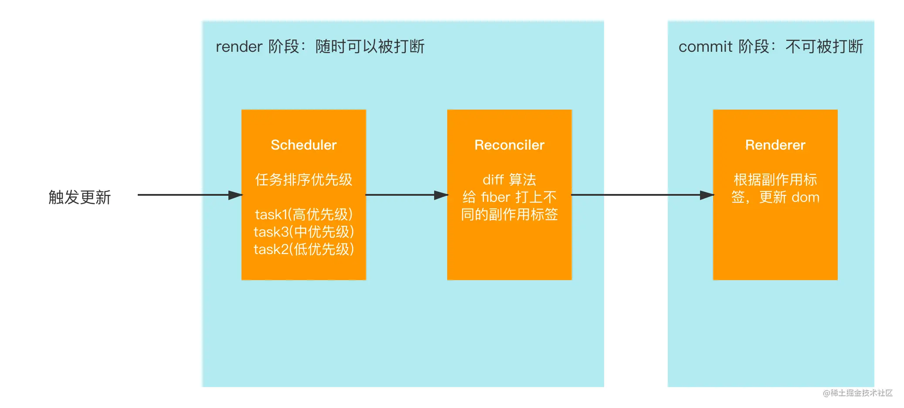
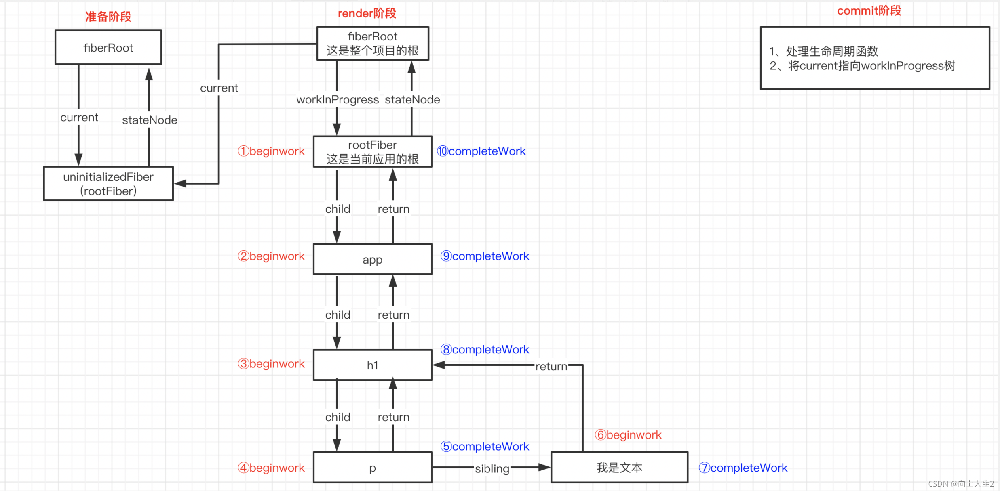

### react render

react为了确保流畅的渲染，react16之后更新过程分为render和commit两个阶段，render阶段包括了scheduler（调度器）和
reconciler（协调器）
commit阶段包含了renderer（渲染器）

#### react 渲染机制



- 触发更新
  触发更新的条件有三种 ReactDOM.render(首次渲染)，setState,forUpdate,setState,hooks中的useState和ref改变
- scheduler
  在首次渲染或者组件状态发生更新的情况，此时界面发生渲染，scheduler过程就会对诸多的任务进行优先级排序，
  让浏览器的每一帧优先执行高优先级的任务（例如动画、用户点击输入事件等），从而防止react的更新任务太大影响到用户交互，保证了页面的流畅性。
- reconciler
  reconciler过程，会根据优先级来执行任务"更新任务"，这个过程主要是新构建的fiber树和旧的fiber树进行diff对比，对fiber节点标记不同的副作用，对渲染过程中真实dom的增删改。
- commit
  在render阶段中，最终会生成一个effectList数组，记录了页面真实dom的新增、删除和替换等以及一些事件响应，commit会根据effectList对真实的页面进行更新，从而实现页面的改变。

#### 为什么在16之后增加scheduler？

在React15中组件的更新使用递归查找来实现，这样的问题在于一旦开始递归，就没有办法中断，如果组件层级很深，就会出现性能问题，导致页面卡顿。

原理： Scheduler： 主要职责是区分任务优先级，优先执行高优先级的任务；
新的架构在原来的基础上引入了Scheduler(调度器），这个东西是React团队参考浏览器的API：requestIdleCallback实现的。它的主要作用就是调度更新任务：
（1）可以中断当前任务执行更高优先级的任务；
（2）能判断浏览器空闲时间，在恰当的时间将主动权给到浏览器，保证页面性能；并在浏览器下次空闲时继续之前中断的任务；
这样就将之前的不可中断的同步更新变成了异步可中断更新，不直接使用浏览器API可能考虑到兼容问题，可能也有别的方面的考量。

#### Fiber

Fiber是对React的Element对应的数据结构，是虚拟Dom

#####Fiber的数据结构

 ```
 function FiberNode(tag, pendingProps, key, mode) {
  // Instance
  this.tag = tag;   // 组件类型
  this.key = key;   // 组件props上的key
  this.elementType = null;      // ReactElement.type 组件的dom类型， 比如`div, p`
  this.type = null;     // 异步组件resolved之后返回的内容
  this.stateNode = null; // 在浏览器环境对应dom节点

  this.return = null;       // 指向父节点
  this.child = null;        // 孩子节点
  this.sibling = null;      // 兄弟节点， 兄弟节点的return指向同一个父节点

  this.index = 0;
  this.ref = null;          // ref
  this.pendingProps = pendingProps;     // 新的props
  this.memoizedProps = null;        // 上一次渲染完成的props
  this.updateQueue = null;          // 组件产生的update信息会放在这个队列
  this.memoizedState = null;        // // 上一次渲染完成的state
  this.dependencies = null;
  this.mode = mode; // Effects

  this.flags = NoFlags;     // 相当于之前的effectTag， 记录side effect类型
  this.nextEffect = null;   // 单链表结构， 便于快速查找下一个side effect
  this.firstEffect = null;  // fiber中第一个side effect
  this.lastEffect = null;   // fiber中最后一个side effect
  this.lanes = NoLanes;     // 优先级相关
  this.childLanes = NoLanes;  // 优先级相关
  this.alternate = null;    // 对应的是current fiber
}
 ```

#### render 调用堆栈（render call stack）

1. renderWithHooks
   更新组件的函数，使用memo，useCallback，useMemo

2. updateFunctionComponent
3. updateSimpleMemoComponent
4. updateMemoComponent
5. mountLazyComponent

6. beginWork
7. perFormUnitOfWork
8. workLoopSync
9. renderRootSync
10. performSyncWorkOnRoot

##### 流程图

